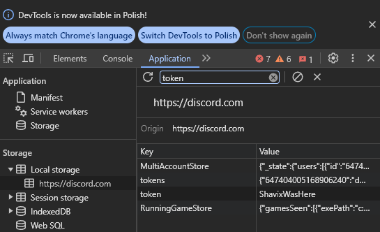
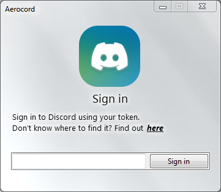

<h1 align="center">
  Aerocord
</h1>

Aerocord is a Discord client written in C#.(tasty glass included)

Supports Windows Vista - Windows 11 (Windows Vista needs proxy settings to work)

# What's working
- Login with email and password
- Logging in with a token
- DMs
- Servers
- Websockets
- Sending messages
- Image viewing
- Video viewing
- Markdown Support
- Mica, Mica Alt and Acryllic Support
- Statuses (work-in-progress)
# Todo
- Custom Emojis
- File uploading
- Reactions
- Fix Aero Glass
- Deleting messages
- Editing messages
- Replying to messages
- VC (dont expect this to happen ever)

# Screenshots

# How to login using a token

1. Login to Discord on any web browser
2. Refresh the page (F5)
3. Do Ctrl + Shift + I (Or just right click and inspect element)
4. Go to Responsive Design Mode (Or if you're on Chrome, it's "Toggle Device Toolbar")
On Firefox it should be an icon with a phone and a tablet, on Chrome a phone with a laptop
5. Go to local storage (on Chrome, go to Application and there should be local storage)
6. In the filter tab, search "token"

8. Get the token and paste it into the Aerocord login page

# Special thanks to:
- [@n1d3v](https://github.com/n1d3v/) for networking
- [WindowsFormsAero](https://github.com/LorenzCK/WindowsFormsAero/) for making it easy to make Aero Windows (not dealing with [DwmExtendFrameIntoClientArea and etc.](https://asp-blogs.azurewebsites.net/kennykerr/Windows-Vista-for-Developers-_1320_-Part-3-_1320_-The-Desktop-Window-Manager))
