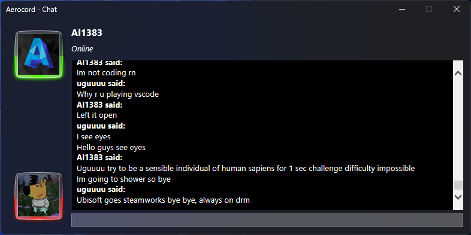

<h1 align="center">
  Aerocord
</h1>

Aerocord is a Discord client written in C#.(tasty glass included)

Supports Windows 7 - Windows 11

# What's working
- Login with email and password
- DMs
- Servers
- Websockets
- Sending messages
- Image viewing
- Video viewing
- Markdown Support
- Mica, Mica Alt and Acryllic Support
- Statuses
# Todo
- Custom Emojis
- File uploading
- Reactions
- Deleting messages
- Editing messages
- Replying to messages
- Fix list background becoming almost opaque in dark mode
- ~~Fix Aero Glass~~ Very impossible
- ~~VC~~ Nuh uh

# Screenshots

# Special thanks to:
- [@n1d3v](https://github.com/n1d3v/) for networking
- [WindowsFormsAero](https://github.com/LorenzCK/WindowsFormsAero/) for making it easy to make Aero Windows (not dealing with [DwmExtendFrameIntoClientArea and etc.](https://asp-blogs.azurewebsites.net/kennykerr/Windows-Vista-for-Developers-_1320_-Part-3-_1320_-The-Desktop-Window-Manager))
