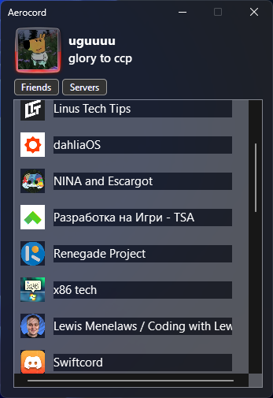

<h1 align="center">
  Aerocord
</h1>

Aerocord is a Discord client written in C#.(tasty glass included)

Supports Windows Vista - Windows 11 (Windows Vista needs proxy settings to work)

# How to login

1. Login to Discord on any web browser
2. Refresh the page (F5)
3. Do Ctrl + Shift + I (Or just right click and inspect element)
4. Go to Responsive Design Mode (Or if you're on Chrome, it's "Toggle Device Toolbar")
On Firefox it should be an icon with a phone and a tablet, on Chrome a phone with a laptop
5. Go to local storage (on Chrome, go to Application and there should be local storage)
6. In the filter tab, search "token"

8. Get the token and paste it into the Aerocord login page

# What's working
- Logging in with a token
- Friends
- DMs
- Basic server functionality
# Todo
- Websockets
- Server channel categories
- Sending messages
- File uploading
- Image viewing
- Reactions
- Status
- Login with email and password
- Fix Aero Glass
- Add Mica or Acrylic
# Screenshots

# Special thanks to:
- @n1d3v for networking
- [WindowsFormsAero](https://github.com/LorenzCK/WindowsFormsAero/) for making it easy to make Aero Windows (not dealing with [DwmExtendFrameIntoClientArea and etc.](https://asp-blogs.azurewebsites.net/kennykerr/Windows-Vista-for-Developers-_1320_-Part-3-_1320_-The-Desktop-Window-Manager))